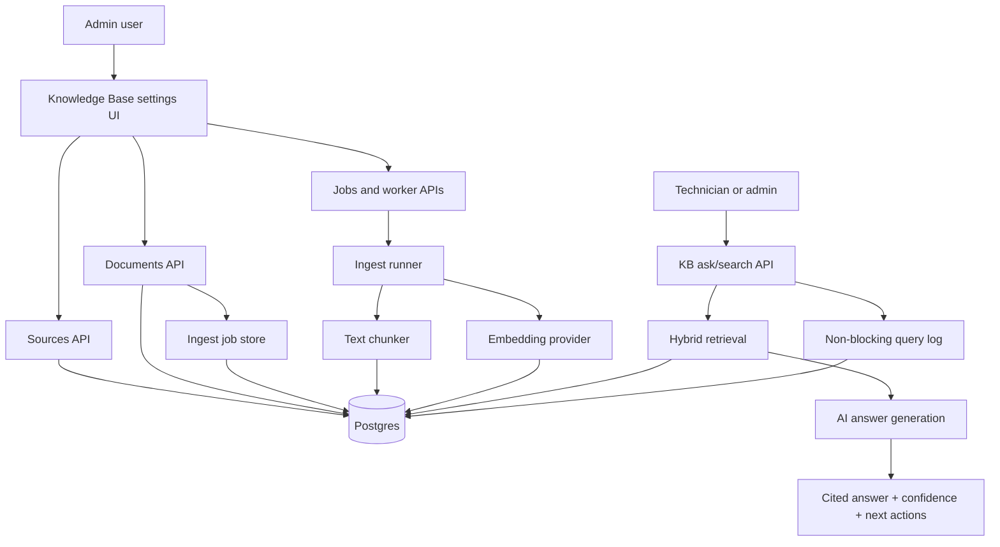

# Next-Generation Knowledge Base Implementation in a CMMS System

## Overview

This repository is a public-safe technical showcase of a knowledge-base feature built for a modern CMMS platform. It explains how maintenance SOPs, FAQs, manuals, help articles, and operational guidance can be ingested into a tenant-aware knowledge base, reindexed in the background, and used by an AI assistant without exposing private system data.

The feature solves a common maintenance problem: teams often have the right knowledge, but it is scattered across SOP documents, onboarding guides, inventory rules, PM playbooks, settings notes, and tribal experience. A technician or admin should not have to know where every document lives before asking a useful question. The system turns those documents into searchable, cited, role-aware answers.

This showcase focuses on the engineering design behind the feature:

- KB source management for SOPs, manuals, FAQs, and system-default help packs.
- Document intake with versioning and automatic reindex queuing.
- Asynchronous ingest jobs that chunk documents, create embeddings, and persist searchable chunks.
- Hybrid retrieval that combines full-text search and vector search.
- AI-assisted answers with citations, confidence, next actions, and non-blocking query logs.

For a more formal written version, see [PAPER.md](PAPER.md).

The implementation is intentionally described without private branding, private tenant names, production URLs, real customer data, or proprietary business details.

## Problem

Maintenance teams do not only need work orders. They need context.

A planner may ask why a PM-generated work order behaves differently from a manually created work order. A storeroom lead may need the escalation rule for waiting parts. A new admin may need to know who can change settings. A technician may need the right SOP for a compressor, generator, chiller, or inventory process.

In many CMMS environments, that knowledge lives in disconnected places:

- PDFs and SOP documents.
- Internal training notes.
- Help center articles.
- Admin-only configuration guidance.
- Maintenance playbooks owned by different departments.
- AI assistant prompts that need trusted grounding.

The business problem is not just search. The real problem is trust. If an AI helper answers from stale, uncited, or unauthorized knowledge, it can create confusion and operational risk. A CMMS knowledge base needs to answer questions, show its evidence, respect tenant boundaries, and keep indexing work observable.

## Solution

The feature introduces a controlled knowledge-base pipeline.

Admins register sources, paste or upload documents, and trigger reindexing. The system saves documents under the correct tenant, creates an ingest job, chunks the text, embeds chunks, and writes both text-searchable and vector-searchable records. The assistant retrieves relevant chunks, fuses lexical and semantic matches, asks the model to answer only from retrieved context, and returns citations plus next actions.

The design is maintainable because each concern has a clear boundary:

- The UI manages source setup, document intake, job status, and document browsing.
- API routes enforce tenant access and admin permissions.
- The ingest runner handles background reindexing and failure state.
- The retrieval layer owns full-text search, vector search, filtering, and rank fusion.
- The ask layer owns grounded answer generation, citations, confidence, and fallback behavior.
- The query log captures observability data without storing raw chunk text.

## Visual Overview



## Key Features

- Tenant-aware source registration keeps each organization's manuals, SOPs, and help articles scoped to the right tenant rather than mixing knowledge across customers.
- Document intake supports plain text, metadata, language, external IDs, and version increments so reindexing can be repeated safely as content changes.
- Reindex requests return quickly with a job ID, while chunking and embedding run asynchronously so the admin UI stays responsive.
- The ingest job lifecycle records `PENDING`, `PROCESSING`, `COMPLETED`, and `FAILED` states, which makes background work visible and retryable.
- Hybrid retrieval combines full-text search and vector search, reducing the chance that useful SOP content is missed because a user phrased a question differently from the source document.
- The answer layer requires citations in `[doc:n]` form and returns confidence, citations, hits, and next actions instead of a vague AI paragraph.
- Query logging stores route, filters, latency, confidence, retrieved chunk IDs, and citation IDs without storing raw chunk content in the log path.

## Architecture

The feature has five main layers.

**UI Layer**

The Knowledge Base settings page lets admins create sources, add documents, refresh defaults, reindex sources, inspect documents, and monitor ingest jobs. The UI polls only while a job is active, which keeps the page fresh without constant background traffic.

**API Layer**

Tenant-scoped API routes handle sources, documents, reindex requests, jobs, worker execution, search, and ask workflows. Admin-only operations such as source and document management are protected behind role checks. User-facing ask/search routes derive filters from tenant access and UI context.

**Business Logic Layer**

The core logic is split into small modules:

- `kb-admin-store` lists sources and documents with short-lived caches.
- `kb-ingest-job-store` creates, claims, completes, fails, and lists jobs.
- `kb-ingest-runner` rebuilds chunks and embeddings for active documents.
- `kb/chunking` creates overlapping chunks.
- `kb/retrieval` runs full-text and vector search in parallel, then fuses results.
- `kb/ask` builds grounded AI answers with citations and deterministic next actions.

**Persistence Layer**

The data model uses separate tables for sources, documents, chunks, ingest jobs, and query logs. Chunks store text, metadata, token estimates, and optional `vector(1536)` embeddings. Indexes are scoped by tenant and common query dimensions.

**Background Processing**

Reindexing is job-based. Creating a document can queue a job automatically. A worker endpoint can execute pending jobs, and server-side post-response work can run ingestion after returning the API response.

## Data Flow


Data moves through two loops. The ingest loop turns documents into searchable chunks. The answer loop retrieves those chunks, builds grounded context, and returns a response that the UI can render safely.

## Technical Highlights

- **Controlled API boundary:** UI code never writes directly to the database. All source, document, job, and ask workflows pass through tenant-aware routes.
- **Migration-aware schema:** Knowledge data is separated into source, document, chunk, job, and query-log tables, which supports future changes without forcing one overloaded table to do everything.
- **Idempotent document updates:** Documents with external IDs use upsert semantics and version increments, making system-default help packs and recurring imports safer to refresh.
- **Asynchronous ingest:** Reindexing has an explicit job lifecycle, so expensive embedding work does not block the admin interaction.
- **Hybrid retrieval:** Full-text search handles exact operational language, while vector search handles semantic matches. Reciprocal rank fusion merges both.
- **Safe observability:** Query logging stores metrics and identifiers, not raw retrieved text, reducing the privacy footprint of analytics.
- **AI fallback behavior:** If chat runtime is unavailable, retrieval still returns evidence and a lower-confidence response instead of failing the full workflow.

## Selected Code Walkthrough

See [code-samples/selected-snippets.md](code-samples/selected-snippets.md) for sanitized snippets covering:

- Admin document intake and automatic reindexing.
- Ingest job claiming and completion.
- Chunking and embedding writes.
- Hybrid retrieval and rank fusion.
- Query logging without raw chunk text.

## Screenshots / Visuals

The original feature includes admin screens for:

- KB source creation and refresh controls.
- Document intake with source, language, title, and raw text fields.
- Source list with document counts, system-default badges, and reindex actions.
- Document list with versions, character counts, language, and status.
- Ingest job list with processing/completed states and retry status.
- AI helper panel with mode selection and page-aware questions.

This repository does not include raw product screenshots because screenshots should be reviewed and sanitized before public release. See [screenshots/README.md](screenshots/README.md) for the recommended screenshot set.

## What This Demonstrates

This showcase demonstrates the ability to design a production-oriented knowledge system rather than a thin AI wrapper. It shows how to connect UI workflows, tenant-aware APIs, background jobs, database design, retrieval, AI grounding, and observability into one coherent feature.

From an engineering portfolio perspective, it proves:

- System design across frontend, backend, data, and AI layers.
- Practical handling of long-running work through job state.
- Awareness of tenant isolation and role-based access.
- Retrieval design that balances exact search and semantic search.
- Product judgment around citations, confidence, and human trust.

## Lessons Learned

Knowledge-base features are deceptively deep. The UI may look like source lists and text boxes, but the hard part is making every answer traceable and every ingest step observable.

The biggest design tradeoff is speed versus correctness. Reindexing immediately after every document save keeps answers fresh, but embedding work can be slow and expensive. A job queue gives the UI fast feedback while preserving a reliable processing path.

Another tradeoff is answer flexibility versus safety. A general AI assistant can sound helpful even when evidence is weak. This design constrains the assistant to retrieved context, citations, and confidence so users can judge whether the answer is trustworthy.

## Future Improvements

- Add object-storage backed file uploads for PDFs and manuals.
- Add document diffing so unchanged chunks do not need re-embedding.
- Add scheduled stale-source review reminders.
- Add admin analytics for unanswered questions and low-confidence answers.
- Add richer role visibility rules for department-specific SOPs.
- Add evaluation dashboards from golden question sets.
- Move ingest execution to a dedicated durable queue when traffic grows.

## Repository Structure

```text
.
|- README.md
|- PAPER.md
|- docs/
|  |- architecture.md
|  |- implementation.md
|  |- design-decisions.md
|  |- data-flow.md
|  `- future-improvements.md
|- diagrams/
|  |- architecture.mmd
|  |- data-flow.mmd
|  `- sequence-flow.mmd
|- code-samples/
|  |- README.md
|  `- selected-snippets.md
|- screenshots/
|  `- README.md
|- assets/
|  `- README.md
|- CHANGELOG.md
|- LICENSE
`- .gitignore
```

## Security and Privacy Notes

This showcase is sanitized for public viewing.

- Private product branding was removed.
- Tenant IDs, user IDs, source IDs, and production URLs were replaced with generic names.
- No API keys, tokens, connection strings, credentials, or customer data are included.
- Code snippets are shortened and sanitized to show design patterns rather than private implementation details.
- Screenshots are described but not included until they can be reviewed for public release.

## License

MIT. See [LICENSE](LICENSE).
