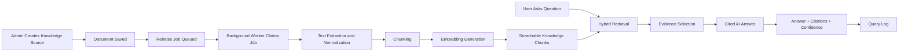

# Tenant-Aware CMMS Knowledge Base with Cited AI Answers

This project is a public-safe technical showcase of a CMMS knowledge-base feature designed to
support controlled AI-assisted answers inside an enterprise maintenance management system.

The goal is not to build a generic chatbot. The goal is to help maintenance teams turn approved
operational knowledge - SOPs, FAQs, manuals, help articles, preventive maintenance rules, and
inventory procedures - into reliable, cited answers that respect tenant boundaries, role
permissions, and operational context.

For a more formal write-up, see [PAPER.md](PAPER.md).

![Tenant-aware CMMS knowledge base architecture][kb-hero-architecture]

## Project Snapshot

**Project type:** Technical portfolio case study  
**Domain:** CMMS, enterprise maintenance, multi-tenant SaaS, AI knowledge retrieval  
**Primary users:** Maintenance admins, planners, supervisors, technicians, and support teams  
**Core idea:** Convert approved maintenance knowledge into tenant-aware, searchable, cited AI
answers.

Core capabilities:

- Tenant-aware knowledge source management
- Document intake for SOPs, FAQs, manuals, and help content
- Asynchronous reindexing jobs with visible job status
- Text chunking and embedding generation
- Hybrid retrieval using full-text and vector search
- AI answers grounded in retrieved evidence
- Citation support for answer traceability
- Query logging for observability and quality review
- Privacy-conscious design that avoids storing raw private content in logs

## Why This Matters

Maintenance teams make decisions with real operational consequences. A work order may affect
equipment uptime, safety, parts availability, technician time, and compliance. The knowledge
needed to make those decisions is often scattered across SOPs, training notes, manuals, admin
settings, PM rules, and inventory procedures.

A basic chatbot can produce a fluent answer. That is not enough for a CMMS. Users need to know
where the answer came from, whether the answer applies to their tenant and role, and what action
they should take next.

This feature treats the knowledge base as an enterprise system component, not as a prompt
wrapper. It manages source content, indexes documents, retrieves evidence, generates cited
answers, and logs quality signals without copying private SOP text into observability logs.

## What I Built

I built a public-safe showcase of a knowledge-base workflow that includes both product behavior
and backend architecture:

- An admin-facing Knowledge Base page for source management and document intake.
- Source records for SOPs, manuals, FAQs, help articles, PM rules, and inventory guidance.
- Document records with title, language, raw text, metadata, versioning, and source ownership.
- Reindex jobs that move through visible states such as `PENDING`, `PROCESSING`, `COMPLETED`,
  and `FAILED`.
- A chunking and embedding pipeline that turns documents into searchable knowledge chunks.
- Hybrid retrieval that combines full-text search and vector search.
- An AI answer path that returns answer text, citations, confidence, next actions, and retrieved
  evidence.
- A query-log path that supports review and improvement without storing raw private document
  content.

## High-Level Architecture

The architecture is split into three visible zones:

- **Knowledge Sources:** SOPs, FAQs, manuals, help articles, PM rules, and inventory rules.
- **Controlled KB Pipeline:** source management, document intake, asynchronous ingest jobs,
  chunking, embeddings, and hybrid retrieval.
- **CMMS AI Assistant:** cited answers, confidence score, next actions, and query logging.

The bottom layer is the real differentiator: tenant isolation, role access, and no private data
in logs. That boundary keeps the feature aligned with enterprise SaaS expectations instead of
behaving like a generic AI demo.

## End-to-End Workflow

An admin starts by creating a source, such as `Maintenance SOPs` or `System Default Help`. They
paste or upload document content, assign language and metadata, and save the document. Saving
can queue a reindex job automatically.

The reindex job runs in the background. It reads active documents for the source, splits text
into overlapping chunks, generates embeddings in batches, and stores searchable chunks. Once
complete, the assistant can retrieve those chunks when users ask questions.

When a user asks a question, the system applies tenant and role filters, retrieves evidence
using both full-text and vector search, fuses the results, and asks the AI layer to answer only
from retrieved context. The response includes citations, confidence, and next actions.

![Asynchronous ingest pipeline from document save to searchable chunks][ingest-pipeline]

## Data Flow



![Hybrid retrieval from user question to cited AI answer][hybrid-retrieval]

This flow creates two feedback loops:

- The ingest loop turns approved documents into searchable chunks.
- The answer loop turns user questions into cited answers and quality signals.

Those quality signals can later guide content review, reindexing, and self-learning
improvements.

## Technical Highlights

- **Tenant-aware boundaries:** Sources, documents, chunks, jobs, and query logs are
  tenant-scoped so knowledge from one organization cannot leak into another.
- **Role-aware retrieval:** User role and UI context are applied before retrieval, which helps
  keep admin-only documents protected.
- **Asynchronous ingest:** Document saves can return quickly while chunking and embeddings run
  through visible background jobs.
- **Hybrid search:** Full-text search catches exact maintenance terms, while vector search
  catches semantic matches. Rank fusion combines both.
- **Cited answer model:** The assistant returns citations and confidence so users can inspect
  the evidence behind an answer.
- **Privacy-conscious logging:** Query logs store metadata, timing, confidence, retrieved chunk
  IDs, and citation IDs, not raw SOP text.
- **Operational next actions:** Answers can include actions such as opening work orders,
  inventory, PM, equipment, or settings pages.
- **Failure visibility:** Job status and retry count make ingest failures observable instead of
  hiding them behind the UI.

## Engineering Constraints

This feature was designed around enterprise constraints that matter in CMMS software:

- Maintenance guidance can be safety-sensitive, so answers must be grounded and traceable.
- Tenant data must remain isolated across organizations.
- Role permissions must apply before retrieval, not after an answer is generated.
- Reindexing may be slow or provider-dependent, so it needs background job state.
- Logs are useful for quality review, but raw private documents should not be copied into logs.
- AI should assist decisions, not silently change work orders, inventory, or maintenance policy.

![Security and privacy boundary diagram][security-boundary]

## Example Use Cases

- A technician asks how to start using the AI helper and receives a cited onboarding answer.
- A planner asks why PM-generated work orders behave differently from manual work orders.
- A storeroom lead asks why inventory did not change after approval and receives an answer
  grounded in issue rules.
- An admin asks who can change settings and receives role-aware guidance.
- A supervisor asks when to use waiting-parts status and gets next actions linked to the
  relevant process.
- A maintenance lead reviews low-confidence queries to identify missing or stale SOP content.

## Screenshots

### Knowledge Source Management

![Knowledge Base source list][source-list]

What it demonstrates:

- **Product workflow:** Admins can inspect registered knowledge sources, active state, document
  counts, update timestamps, and explicit reindex actions.
- **Engineering decision:** Knowledge is organized by tenant-scoped sources instead of being
  pushed directly into an unstructured assistant prompt.
- **Technical capability:** Source status, document count, default-pack metadata, and reindex
  triggers make indexing behavior visible and reviewable.

### Document Intake

![Knowledge Base source and document intake showing document fields][knowledge-base-intake]

What it demonstrates:

- **Product workflow:** Admins can add SOPs, FAQs, manuals, help articles, PM guidance, and
  inventory procedures without a developer rebuilding the index by hand.
- **Engineering decision:** Document intake captures source, language, title, and raw text as
  managed content before retrieval is allowed.
- **Technical capability:** Saving content can queue asynchronous reindexing so fresh knowledge
  becomes searchable without blocking the admin UI.

### Document List

![Knowledge Base documents list][documents-list]

What it demonstrates:

- **Product workflow:** Users can review the latest documents attached to a source, including
  status and content metadata.
- **Engineering decision:** Knowledge is treated as version-aware operational content rather
  than disposable chat context.
- **Technical capability:** Version, character count, language, active state, and pack labels
  support auditability and safer refresh workflows.

### Ingest Job Monitoring

![Asynchronous ingest pipeline from document save to searchable chunks][ingest-pipeline]

What it demonstrates:

- **Product workflow:** Admins can understand that document saves create background work with
  visible states such as `PENDING`, `PROCESSING`, `COMPLETED`, and `FAILED`.
- **Engineering decision:** Reindexing is modeled as asynchronous job processing instead of a
  hidden synchronous side effect.
- **Technical capability:** Status, retry, chunking, embedding generation, and searchable-chunk
  storage can be monitored and debugged independently.

The raw ingest-jobs screenshot is intentionally excluded until source IDs, job IDs, user names,
and timestamps are masked or cropped.

### AI Helper Panel

![Annotated AI helper mockup][ai-helper-annotated]

What it demonstrates:

- **Product workflow:** A user can ask a maintenance question and receive an answer grounded in
  approved knowledge.
- **Engineering decision:** The assistant returns citations, confidence, and next actions so the
  answer can be inspected instead of merely trusted.
- **Technical capability:** Tenant-aware context, evidence-backed answer generation, citation
  metadata, and query logging connect the KB pipeline to the user-facing AI workflow.

## Selected Code Walkthrough

The full snippets are in [code-samples/selected-snippets.md](code-samples/selected-snippets.md).
This section summarizes the engineering decisions in a portfolio-friendly format.

### Document Save and Reindex Queue

**Problem:** Admins need to add or update SOPs without manually triggering a separate indexing
script.

**Decision:** Save the document through a tenant-scoped API route, invalidate relevant caches,
and queue a reindex job when `autoReindex` is enabled.

**Impact:** The UI stays simple, documents remain versioned, and fresh knowledge becomes
searchable without manual backend intervention.

### Background Job Claiming

**Problem:** Reindexing can be slow, retried, or triggered more than once.

**Decision:** Claim jobs only when they belong to the current tenant and are in a claimable
state such as `PENDING` or `FAILED`.

**Impact:** The system avoids duplicate work, protects tenant boundaries, and gives admins
visible job status.

### Chunking and Embedding

**Problem:** Long SOPs and manuals cannot be searched or embedded as one large text blob.

**Decision:** Rebuild document chunks from source text, use overlap to preserve context, and
generate embeddings in batches.

**Impact:** Retrieval quality improves, embedding calls are more predictable, and stale chunks
are removed during reindexing.

### Hybrid Retrieval

**Problem:** Maintenance users ask questions using exact terms, abbreviations, and informal
phrasing.

**Decision:** Run full-text and vector retrieval in parallel, then combine results with rank
fusion.

**Impact:** The assistant can find both exact operational matches and semantically similar
guidance.

### Query Logging

**Problem:** The team needs quality signals without creating a second store of private SOP text.

**Decision:** Log route, filters, latency, confidence, retrieved chunk IDs, and citation IDs,
but not raw retrieved content.

**Impact:** The system supports observability and future content improvement while reducing
privacy risk.

## Security and Privacy Notes

This repository is public-safe by design.

- Private product branding is not used.
- No customer names, tenant IDs, production URLs, emails, credentials, or real operational data
  are included.
- All published screenshots are sanitized before inclusion. Additional ingest-job screenshots
  are excluded until source IDs, job IDs, user names, and timestamps are masked or cropped.
- Code snippets are shortened and generalized to explain engineering decisions without exposing
  private implementation details.
- Query logging is described as metadata-oriented and intentionally avoids raw private document
  text.

## What This Project Demonstrates

This project demonstrates practical engineering ability across several layers:

- CMMS domain modeling
- Multi-tenant SaaS architecture
- Async background job design
- Document ingest and reindexing pipeline
- Chunking and embedding workflow
- Full-text and vector retrieval
- Citation-aware AI answer generation
- Privacy-conscious logging
- Production-oriented feature design
- Public-safe technical documentation

## Why This Is Different from a Basic Chatbot

A basic chatbot usually accepts a prompt and returns text. This feature does more.

It manages approved source content. It indexes documents. It applies tenant and role filters
before retrieval. It combines lexical and semantic search. It requires citations. It returns
confidence and next actions. It logs quality signals without storing raw SOP text.

That difference matters because enterprise maintenance software cannot rely on fluent answers
alone. It needs accountable answers that users can trace back to approved operational knowledge.

## Future Improvements

- Add secure PDF and document upload parsing.
- Add chunk-level diffing so unchanged content does not need re-embedding.
- Move ingest execution to a durable queue for higher-volume deployments.
- Add admin dashboards for low-confidence questions and missing knowledge topics.
- Add document owner, review cadence, stale-content warnings, and approval state.
- Add more granular role visibility for admin-only or department-specific SOPs.
- Add golden-question evaluation reports to measure retrieval and answer quality over time.

## Repository Structure

```text
.
|- README.md
|- PAPER.md
|- docs/
|  |- architecture.md
|  |- implementation.md
|  |- design-decisions.md
|  |- data-flow.md
|  `- future-improvements.md
|- diagrams/
|  |- architecture.mmd
|  |- data-flow.mmd
|  `- sequence-flow.mmd
|- assets/
|  |- kb-hero-architecture.svg
|  |- ingest-pipeline.svg
|  |- hybrid-retrieval.svg
|  |- security-boundary.svg
|  |- ai-helper-annotated.png
|  `- README.md
|- screenshots/
|  |- knowledge-base-intake.jpg
|  |- source-list.jpg
|  |- documents-list.jpg
|  |- ai-helper-panel.jpg
|  `- README.md
|- code-samples/
|  |- README.md
|  `- selected-snippets.md
|- CHANGELOG.md
|- LICENSE
`- .gitignore
```

## Summary

This showcase presents a CMMS knowledge-base feature as an enterprise AI retrieval system. It
demonstrates how approved maintenance knowledge can be ingested, indexed, retrieved, cited, and
logged in a way that respects tenant boundaries and operational trust.

The result is not a chatbot pasted onto a CMMS. It is a controlled knowledge workflow that makes
AI answers more useful, safer to review, and easier to improve over time.

## License

MIT. See [LICENSE](LICENSE).

[kb-hero-architecture]: assets/kb-hero-architecture.svg
[ingest-pipeline]: assets/ingest-pipeline.svg
[hybrid-retrieval]: assets/hybrid-retrieval.svg
[security-boundary]: assets/security-boundary.svg
[source-list]: screenshots/source-list.jpg
[knowledge-base-intake]: screenshots/knowledge-base-intake.jpg
[documents-list]: screenshots/documents-list.jpg
[ai-helper-annotated]: assets/ai-helper-annotated.png
