# Tenant-Aware CMMS Knowledge Base for Next-Generation CMMS/EAM

This repository is a public-safe portfolio case study for a CMMS/EAM knowledge-base feature.

The feature is not a generic chatbot. It is a governed knowledge layer that turns approved maintenance content — SOPs, manuals, FAQs, PM rules, inventory procedures, safety guidance, and help articles — into cited answers inside a maintenance workflow.

The main product idea is simple:

> Maintenance teams should be able to ask practical questions and see where the answer came from.

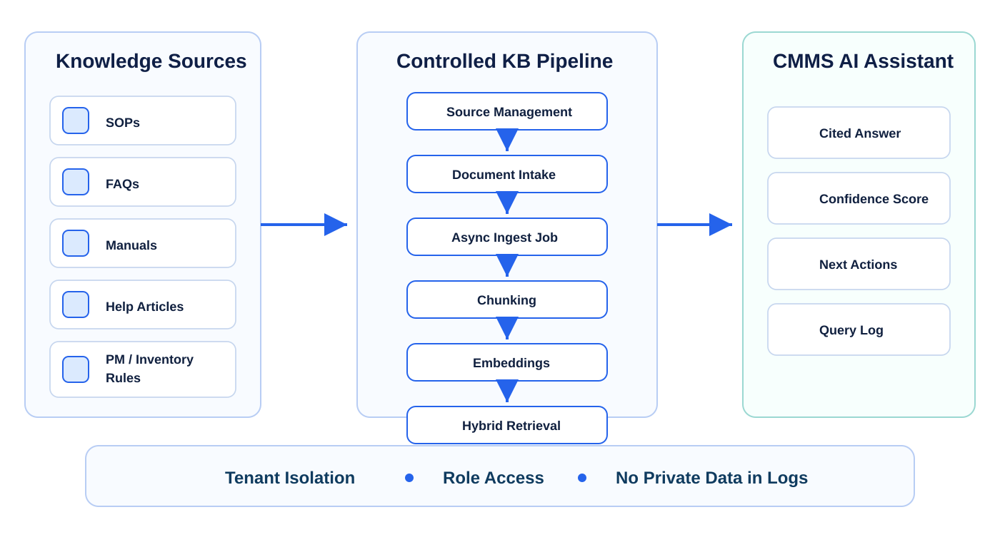

## Project snapshot

| Area | Detail |
| --- | --- |
| Project type | Technical portfolio case study |
| Domain | CMMS, EAM, maintenance operations, multi-tenant SaaS, AI retrieval |
| Primary users | Maintenance admins, planners, supervisors, technicians, inventory leads, support teams |
| Core idea | Convert approved maintenance knowledge into searchable, tenant-aware, cited answers |
| Design stance | AI can assist and explain; it should not silently change work orders, inventory, or policy |

## What this showcases

This repo focuses on the product and engineering work behind a next-generation CMMS/EAM knowledge base:

- Tenant-aware source management for SOPs, manuals, FAQs, PM rules, and inventory guidance.
- Admin-controlled document intake with language, version, status, visibility, and review metadata.
- Asynchronous reindex jobs with visible status instead of hidden indexing side effects.
- Text chunking and embedding generation for searchable knowledge slices.
- Hybrid retrieval using keyword search and semantic matching.
- Cited AI answers with confidence, next actions, and retrieved evidence.
- Query logging that records quality signals without copying raw private SOP text into logs.
- A review loop for stale content, low-confidence questions, missing documents, and repeated user confusion.

## Why this matters in CMMS/EAM

Maintenance decisions have operational consequences. A short answer can affect equipment downtime, technician safety, parts availability, compliance, and customer service.

A basic chatbot can sound confident. That is not enough for maintenance software. A CMMS/EAM assistant needs to answer from approved content, respect tenant and role boundaries, show citations, and expose uncertainty when the evidence is weak.

This design treats knowledge as an enterprise system component:

1. Admins own the source content.
2. The system indexes it in a visible, retryable way.
3. Retrieval applies tenant and role filters before answer generation.
4. Answers include citations and next actions.
5. Logs become a content-improvement signal, not a second copy of private documents.

## Feature tour

### 1. Knowledge source management

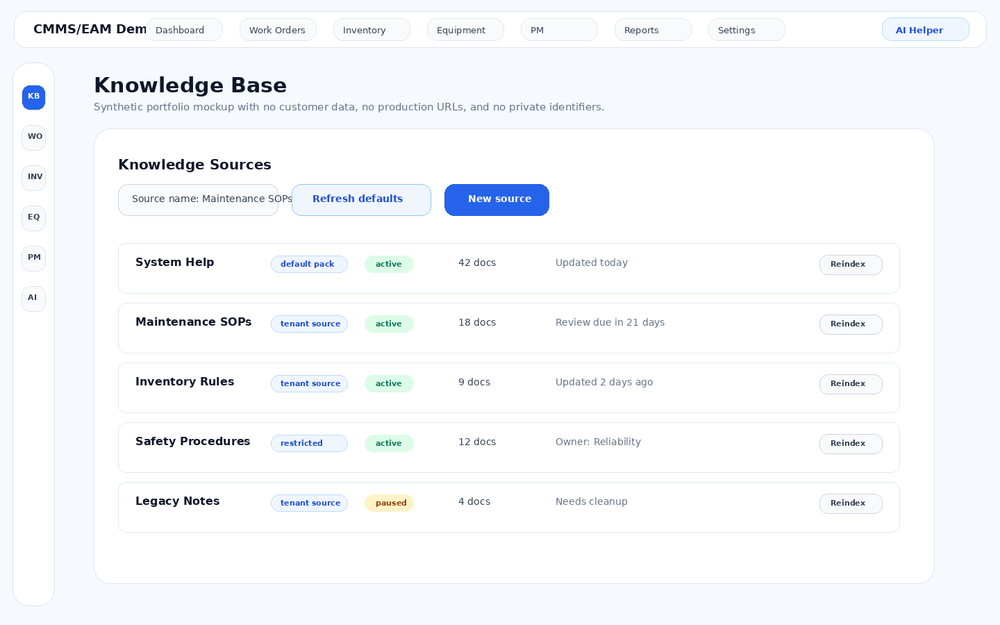

Admins can review source status, document counts, default-pack labels, review cadence, and reindex actions. The important design choice is that knowledge is managed as tenant-scoped source content, not pasted into prompts.

### 2. Document intake

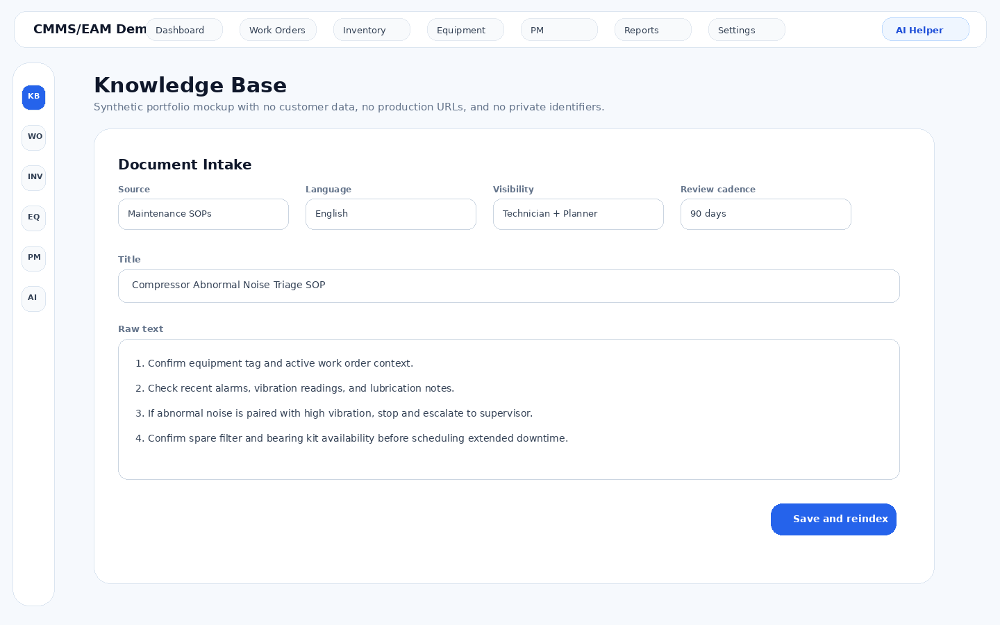

The intake flow captures source, title, language, visibility, review cadence, and raw text. Saving a document can queue a reindex job so new knowledge becomes searchable without blocking the admin page.

### 3. Document list and review state

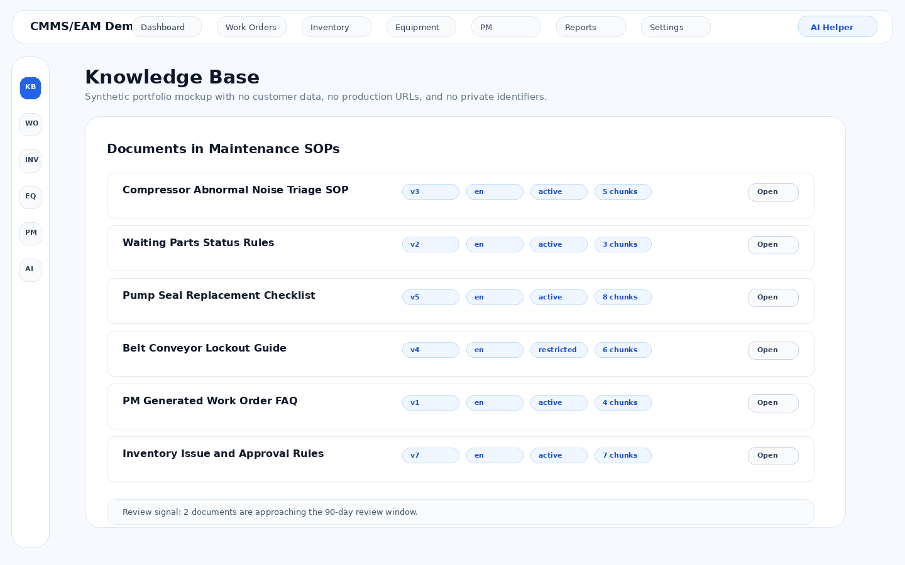

Documents are treated as operational content. Version, language, active state, restricted visibility, chunk count, and review signals matter because stale or wrong maintenance guidance can create real operational risk.

### 4. AI helper panel

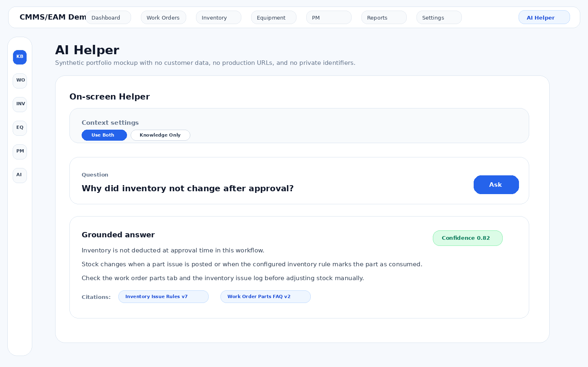

The helper returns a grounded answer, citations, confidence, and practical next actions. It is designed to support decisions, not replace approved procedures or bypass permissions.

## Architecture at a glance

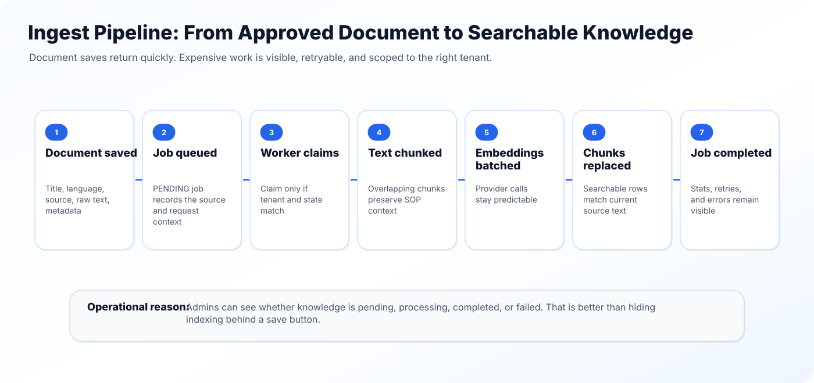

The architecture has four layers:

1. **Source governance** — admin-managed sources, documents, versions, metadata, visibility, review cadence.
2. **Ingest pipeline** — background jobs, chunking, embeddings, derived searchable records.
3. **Retrieval and answer path** — tenant filters, role filters, hybrid retrieval, rank fusion, cited response.
4. **Feedback loop** — query logs, low-confidence review, stale-document review, missing-content backlog.

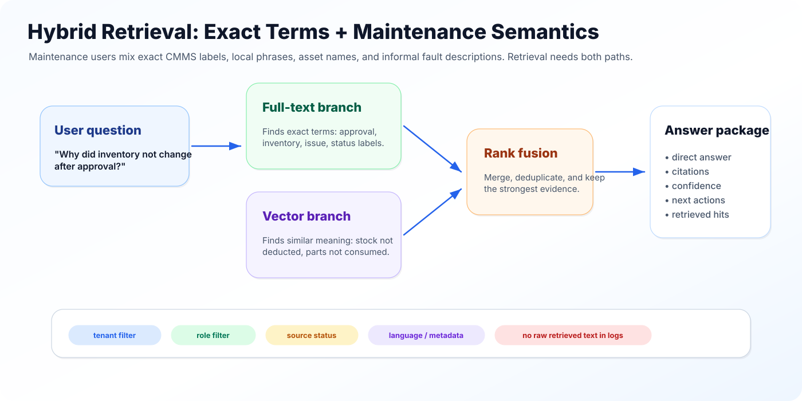

## Graphs and charts

The repository includes several editable SVG charts that can be used directly in a GitHub profile or portfolio page.

### Knowledge lifecycle

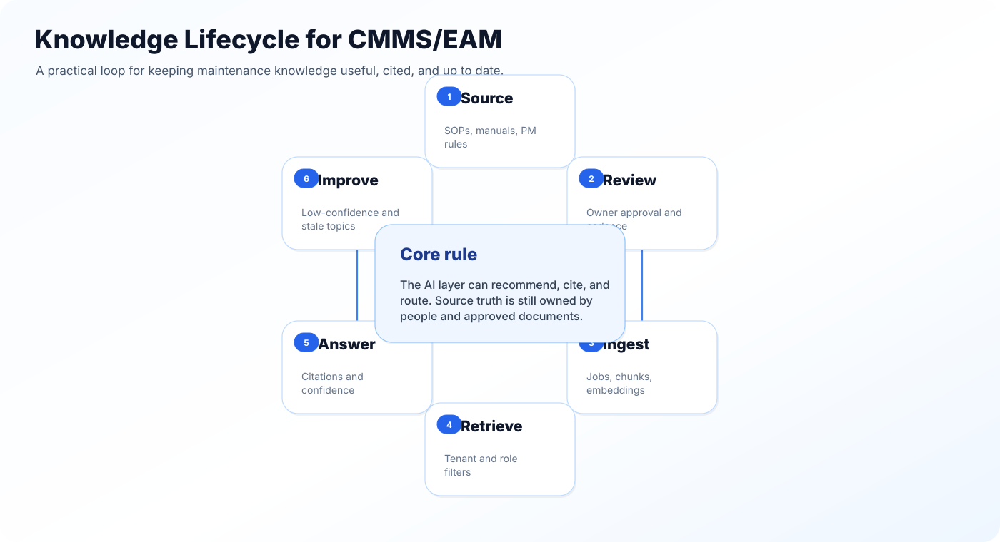

### Retrieval quality scorecard

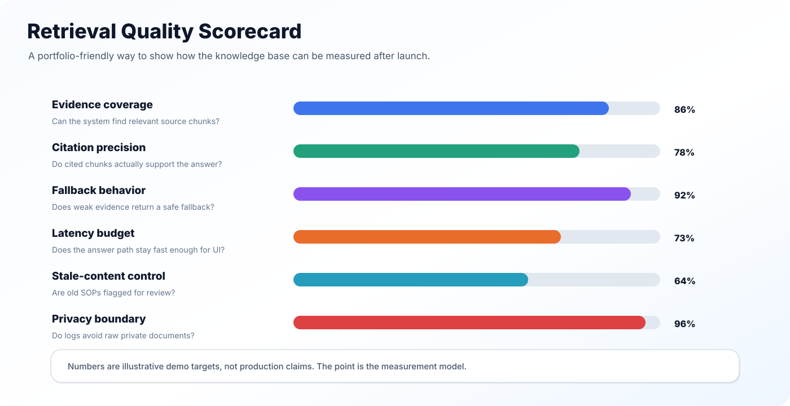

### Use-case leverage matrix

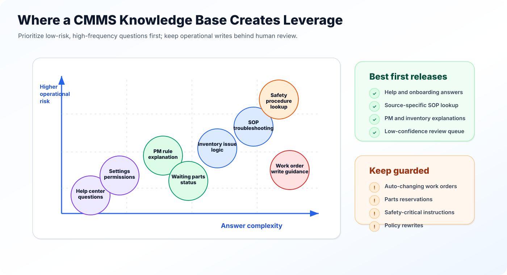

### China manufacturing context

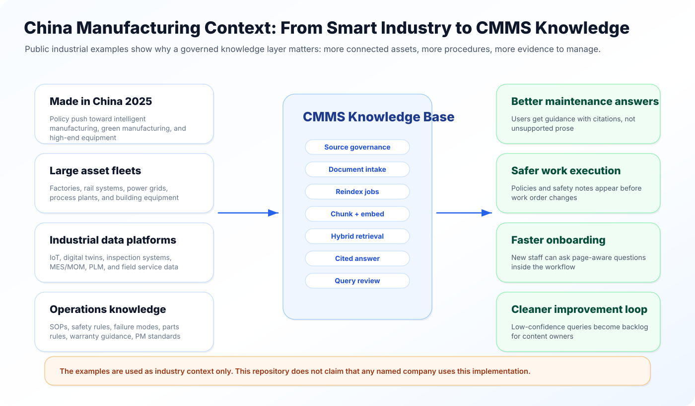

## China / 中国智造 context

China is a useful context for this kind of CMMS/EAM knowledge system because modern manufacturing, rail, power, process industry, building technology, and industrial internet platforms all create more connected assets and more operational knowledge to manage.

This repository uses public industrial examples as context only. It does not claim that any named company uses this implementation.

Examples mapped in the documentation include:

| Example | Public signal | CMMS/EAM knowledge-base angle |
| --- | --- | --- |
| Midea Building Technologies | AI-enabled chiller lighthouse factory and smart O&M recommendations | Connect product knowledge, service diagnostics, energy guidance, and maintenance procedures |
| SANY Group | No. 18 Factory and intelligent heavy-equipment manufacturing | Combine factory maintenance knowledge with field-service and telematics context |
| State Grid | Drone inspection and defect recognition for grid assets | Convert inspection findings into cited repair guidance and work-order context |
| CRRC | Lifecycle intelligent operation and maintenance for rail equipment | Keep safety-critical rail maintenance answers conservative and cited |
| Huawei / industrial connectivity | Fully connected factory infrastructure | Provide the data and network layer that makes governed retrieval valuable |
| COSMOPlat | Industrial internet, digital twin, and scenario solutions | Connect asset knowledge with production, energy, and factory operations |
| Sinopec / process industry | Digital and intelligent development in process operations | Emphasize safety, permits, reliability, and shutdown procedure knowledge |
| Baowu / Baosteel | Online inspection and industrial AI scenarios | Link inspection findings with equipment history and root-cause playbooks |

More detail is in [docs/china-manufacturing-context.md](docs/china-manufacturing-context.md) and [docs/real-world-examples.md](docs/real-world-examples.md).

## Runnable code sample

The `src/` folder contains a small dependency-free JavaScript demo of the retrieval flow. It is intentionally simple and public-safe. It is not a production service.

```bash
node src/demo.js
npm test
```

The demo shows:

- text chunking with overlap;
- tenant and role filtering;
- full-text and simple semantic scoring;
- reciprocal-rank fusion;
- cited answer packaging;
- safe fallback behavior when evidence is weak.

## Repository structure

```text
.
|- README.md
|- PAPER.md
|- docs/
|  |- architecture.md
|  |- implementation.md
|  |- design-decisions.md
|  |- data-flow.md
|  |- knowledge-governance.md
|  |- evaluation.md
|  |- real-world-examples.md
|  |- china-manufacturing-context.md
|  |- portfolio-notes.md
|  |- public-safety.md
|  |- future-improvements.md
|  `- references.md
|- diagrams/
|  |- architecture.mmd
|  |- data-flow.mmd
|  |- sequence-flow.mmd
|  `- governance-loop.mmd
|- assets/
|  |- kb-hero-architecture.svg
|  |- ingest-pipeline.svg
|  |- hybrid-retrieval.svg
|  |- security-boundary.svg
|  |- knowledge-lifecycle.svg
|  |- retrieval-quality-scorecard.svg
|  |- use-case-leverage-matrix.svg
|  `- china-manufacturing-to-kb-map.svg
|- screenshots/
|  |- source-list.png
|  |- knowledge-base-intake.png
|  |- documents-list.png
|  `- ai-helper-panel.png
|- code-samples/
|  |- README.md
|  `- selected-snippets.md
|- src/
|  |- chunkText.js
|  |- rankFusion.js
|  |- retrieveKnowledge.js
|  |- buildAnswerPackage.js
|  |- sampleData.js
|  `- demo.js
|- tests/
|  `- run-tests.js
|- data/
|  |- china-industry-examples.json
|  |- golden-questions.json
|  `- knowledge-sources.json
|- scripts/
|  `- generate_assets.py
|- package.json
|- CHANGELOG.md
|- LICENSE
`- .gitignore
```

## Public-safety notes

This repository is designed for a public portfolio.

- It does not include private product branding.
- It does not include customer names, tenant IDs, production URLs, email addresses, credentials, real source IDs, or real operational data.
- Screenshots are synthetic mockups using generic labels.
- Code is simplified and sanitized to explain architecture decisions without exposing a private implementation.
- Industrial examples are based on public materials and are used only as context for CMMS/EAM product thinking.

## License

MIT. See [LICENSE](LICENSE).
